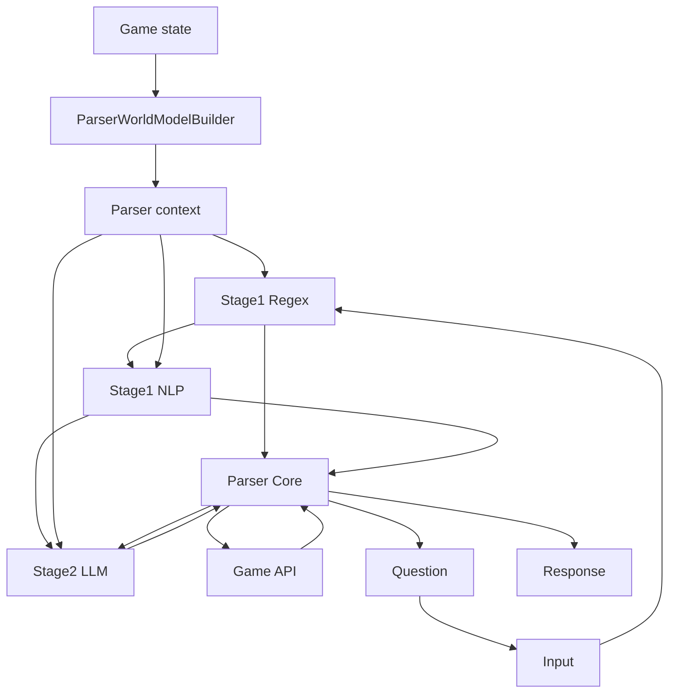
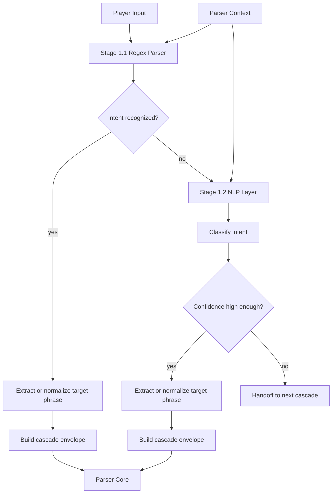
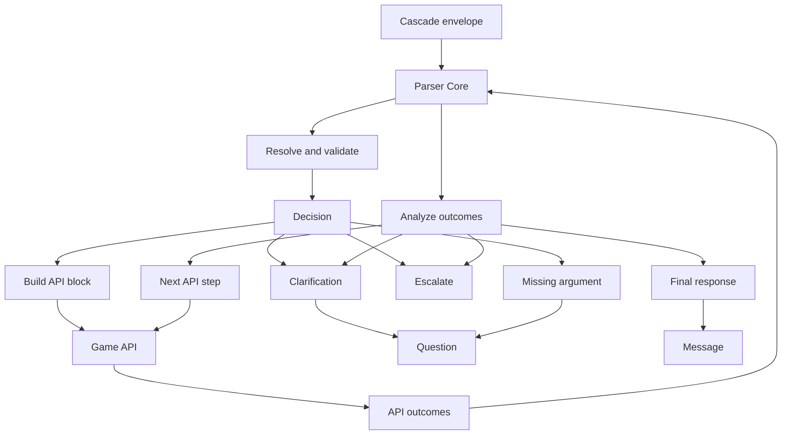
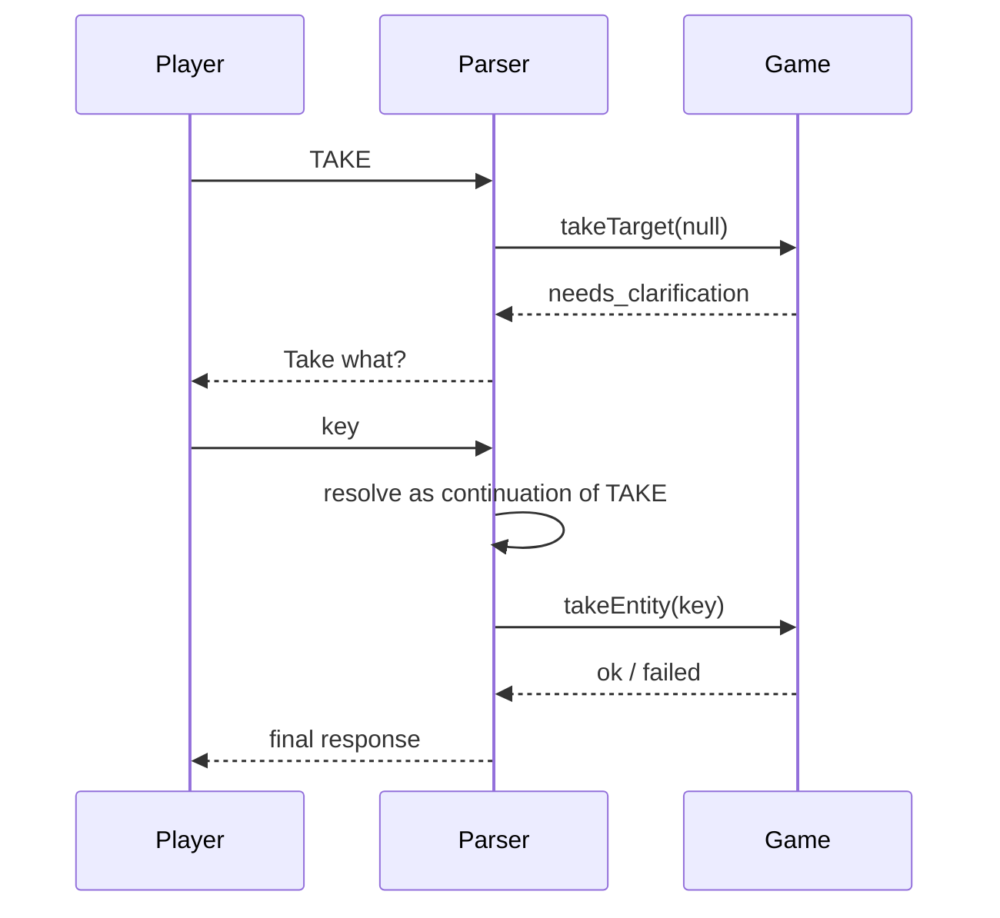
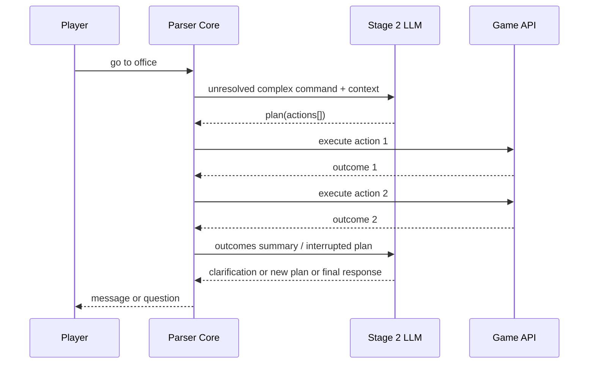
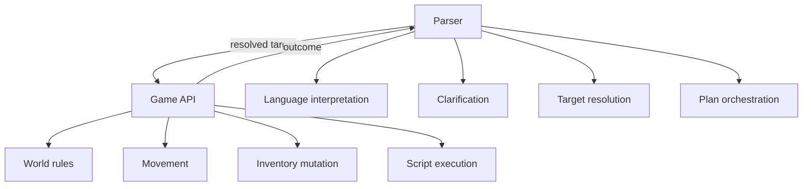

# Parser

## Summary

`Parser` в `Blue Signal` — это отдельный оркестратор между игроком и движком `Scanline`.

Он не является простым обработчиком команд. Его роль ближе к **Game Master**:

- принять ввод игрока;
- увидеть текущую картину мира через `context`;
- выбрать подходящий каскад распознавания;
- разрешить цели команды внутри собственной модели мира;
- вызвать допустимые игровые API;
- проанализировать outcomes;
- либо ответить игроку,
- либо задать уточнение,
- либо передать кейс более сильному каскаду,
- либо сделать следующую итерацию исполнения.

Главный принцип:

- **вся языковая интерпретация живёт внутри parser-а**;
- `Game` и runtime не понимают язык игрока и не резолвят текстовые цели;
- `Game` только исполняет операции над уже понятными сущностями и возвращает structured outcomes;
- parser — не единственный клиент `Game API`: тем же shared API пользуются UI, scripts и игровая логика.

---

## Design Goals

Parser должен:

- быть единственной точкой интерпретации пользовательского текста;
- иметь собственную "картину мира", пригодную для текстового анализа;
- использовать движок как набор инструментов, а не как место принятия языковых решений;
- поддерживать несколько каскадов понимания ввода;
- уметь вести короткий диалог с игроком внутри одной незавершённой команды;
- быть локализуемым без переписывания логики;
- со временем уметь переходить от простого command parser-а к полноценному orchestrator/GM.

---

## High-Level Architecture

Ключевой момент:

- `Player Input` и `Parser Context` — это **две отдельные сущности**;
- `ParserWorldModelBuilder` работает только от состояния игры;
- ввод игрока проходит каскады **последовательно**, а не параллельно.



Что важно в этой схеме:

- ввод игрока всегда сначала идёт в `Stage 1.1`;
- `Stage 1.2` включается только по handoff от `Stage 1.1`;
- следующий каскад включается только после провала всего первого каскада;
- `Core` получает два разных типа входа:
  - распознанные данные от каскадов;
  - outcomes от `Game API`.

---

## Layers

### 1. Raw Game State

Это реальное состояние runtime:

- текущая сцена;
- объекты сцены;
- инвентарь игрока;
- активная subscene;
- registry сцен;
- состояния объектов и компонентов;
- player actor.

Это не parser-слой. Это слой движка.

### 2. ParserWorldModelBuilder

`ParserWorldModelBuilder` не использует ввод игрока для определения intent или target.

Он получает состояние игры, а также metadata текущего parser-цикла, и строит единый `ParserWorldModel`:

- `context`
- `scope`

Текущий context включает:

- `rawInput` и `normalizedInput` как metadata текущего цикла parser-а;
- текущую сцену (`id`, `name`, `title`, `description`, `activeSubscene`);
- список текстово значимых объектов сцены;
- отдельный список `knownEntities` для объектов, известных движку, но не раскрытых player-facing текстовому слою;
- инвентарь игрока;
- spatial nodes and relation projection, derived from the runtime scene hierarchy;
- `pending state`, если parser уже ждёт уточнение.

Текущий scope включает:

- `visible`
- `held`
- `takable`
- `putSource`
- `reachable`
- `examinable`
- `subscene`
- `worldKnown`
- `hiddenKnown`

Важно:

- `ParserWorldModelBuilder` не интерпретирует пользовательский ввод;
- он не выбирает intent;
- он не определяет target;
- он лишь даёт parser-у картину мира.

Scope slices intentionally separate knowledge from actionability:

- `visible` means the player-facing text layer may refer to the object;
- `reachable` means the object is visible, unblocked and close enough for direct interaction;
- `takable` means the object is a valid current source for `TAKE`;
- `putSource` means the object is a valid current source for `PUT` when paired with a destination; this includes held items through `held` and reachable scene items through `putSource`;
- `worldKnown` / `hiddenKnown` are awareness-only slices for higher parser cascades and diagnostics. Built-in Stage 1 commands and clarification options must not use them as actionable candidates.

Clarification must be role-aware. If a command asks the player to choose a source item, options must come from the command's actionable source scope, not from all visible or known objects. Visible-but-unreachable objects may still be used for diagnostics, so parser can answer "You are too far away from X" instead of pretending the object does not exist, but they should not appear as selectable clarification options.

For items stored on `Surface` components, reachability must use the item's `Surface.items` placement coordinates when they exist. `entity.x/y` can lag behind or represent an implementation detail; clarification scopes must follow the actual surface placement that the player sees.

Spatial-проекция приходит из `Game` уже в терминах world model. В частности, `Subscene` раскрывает для runtime и parser-а только **непосредственный** уровень вложенности за одну активацию: parser не должен сам вычислять рекурсивное раскрытие поддерева.

Parser не должен самостоятельно обходить raw `.spatial` как источник истины для relation-aware действий. Для `LOOK IN/ON/...`, `TAKE ... FROM/IN/ON/...` и diagnostics используется та же semantic spatial projection, что и runtime text layer: безымянные технические узлы схлопываются, titled-потомки становятся semantic anchors, а relation descendants считаются относительно выбранного anchor. Например, если `Book B` лежит `on Book A`, а `Book A` лежит `in Cabinet`, то `Book B` входит в `LOOK IN CABINET` и может быть найден через `TAKE Book B FROM Cabinet`; при запросе относительно `Book A` она остаётся `on Book A`.

Пример context:

```json
{
  "rawInput": "look logo",
  "normalizedInput": "LOOK LOGO",
  "scene": {
    "id": "test_room",
    "name": "New Scene",
    "title": "New Scene",
    "description": "You are in New Scene."
  },
  "entities": [
    {
      "id": "logo_1",
      "type": "Entity",
      "title": "logo",
      "description": "You see Scanline Engine logo.",
      "details": null,
      "interactions": []
    }
  ],
  "inventory": [],
  "spatialNodes": [],
  "spatialRelations": [],
  "pending": null
}
```

### 3. Scope Model

`Scope` — это не отдельный каскад и не отдельный runtime subsystem, а структурированная часть `ParserWorldModel`.

То есть:

- `context` = всё, что parser знает о мире;
- `scope` = какая часть этого мира доступна для конкретного класса действий.

Примеры:

- `LOOK` использует видимые объекты сцены и инвентарь;
- `TAKE` использует только берущиеся объекты сцены;
- `EXAMINE` использует инвентарь, объекты активной subscene и объекты в пределах допустимой дистанции;
- `GO TO` использует сценовые цели и достижимые сценовые объекты.

Текущая модель scope:

```ts
type ParserScope = {
  visible: Entity[];
  held: Entity[];
  takable: Entity[];
  reachable: Entity[];
  examinable: Entity[];
  subscene: Entity[];
  sceneTargets: SceneDescriptor[];
};
```

Ключевой принцип:

- scope должен быть общим для всех каскадов;
- каскады различаются тем, **как они понимают ввод**;
- они не должны различаться тем, **как они понимают мир**.

---

## Cascades

## Stage 1

Stage 1 на самом деле состоит из двух внутренних уровней.

### Stage 1.1 — Regex Parser

Это быстрый, детерминированный, дешёвый слой.

Он:

- пытается распознать canonical-команду;
- выделяет базовый `intent`;
- нормализует или очищает `target phrase`;
- для `LOOK` / `EXAMINE` умеет извлекать relation grammar вроде `under`, `in`, `behind`, `near`;
- собирает унифицированный envelope для `Core`.

Подходит для:

- `LOOK`
- `LOOK LOGO`
- `LOOK UNDER TABLE`
- `EXAMINE BOOMBOX`
- `EXAMINE IN DRAWER`
- `TAKE KEY`
- `TAKE ALL CASSETTES`
- `TAKE BLUE AND RED PILLS`
- `PUT ALL CASSETTES INTO RECORDER`
- `PUT BLUE PILL AND RED PILL IN BOX`
- `INV`
- `GO TO OFFICE`

Важно:

- relation-aware parsing уже начинается на уровне `Stage 1.1`;
- direct group syntax для стандартных `TAKE` и `PUT` тоже обрабатывается на уровне `Stage 1.1`, но исполняется как обычный batch plan в `Core`;
- пока runtime не хранит явные object relations, `Core` умеет только:
  - распознать relation-query;
  - разрешить anchor-object через обычный resolution/clarification flow;
  - и затем вернуть честный fallback, что spatial relation пока не может быть определена.

### Stage 1.2 — NLP Layer

Этот слой включается только если `Stage 1.1` не справился.

Он:

- определяет `intent` по более свободному вводу;
- оценивает confidence;
- очищает `target phrase`;
- собирает тот же унифицированный envelope для `Core`, что и `Stage 1.1`.

Он полезен для:

- `look at the lamp`
- `pick up the key`
- `what do i have?`
- `go over to the office`

Важно:

- глагол или verb phrase обычно определяет саму команду;
- слова вроде `with`, `on`, `to`, `in`, `under` обычно являются не отдельными командами, а grammar hints для связывания аргументов или relation semantics.

Важно:

- `Stage 1.2` не занимается world reasoning;
- не должен сам принимать игровые решения;
- не должен сам резолвить сложные semantic target-и;
- не генерирует player-facing ответы.

### Детальная схема Stage 1



Что важно:

- `intent` определяется внутри уровня каскада;
- `target phrase` выделяется и очищается там же;
- затем уровень собирает единый envelope/protocol для `Core`;
- в `Core` приходит уже не сырой ввод, а первичная интерпретация команды.

## Stage 2 — LLM / Future

Следующий каскад — старший, LLM-based.

Его роль намного шире:

- понимать сложные смысловые соответствия;
- строить многошаговые планы;
- генерировать player-facing тексты, когда lower layers не справились;
- задавать сложные уточнения;
- работать как настоящий Game Master.

Например:

- `look logotype` -> понять, что речь о `logo`;
- `go to office` -> построить цепочку действий;
- `examine the thing under the desk` -> понять relation и target.

В отличие от первых двух уровней, stage2 не обязан возвращать только `intent`.

---

## Parser Core

`Parser Core` — центральный оркестратор всей системы.

Он получает:

- cascade envelope от активного каскада;
- outcomes от `Game API` по отдельному каналу.

Именно `Core` принимает решения:

- достаточно ли данных для обработки команды;
- нужно ли звать следующий каскад;
- нужно ли задать clarification;
- какой API-блок вызвать;
- нужно ли сделать следующую итерацию;
- какой итоговый ответ показать игроку.

### Детальная схема Core



Самое важное утверждение:

- `Core` может эскалировать **до API**, если уже видит, что intent/target/данных недостаточно;
- `Core` может эскалировать **после API**, если полученных outcomes недостаточно для завершения сценария.

Именно это делает parser не просто parser-ом, а оркестратором.

---

## Action Flow

### Step 1. Input arrives

Игрок вводит текст.

### Step 2. Pending clarification is checked

Parser сначала проверяет:

- не является ли ввод продолжением уже незавершённой команды;
- или это новая команда.

### Step 3. World model is built

`ParserWorldModelBuilder` строит `ParserWorldModel` из состояния игры:

- `context`
- `scope`

### Step 4. Stage 1 runs sequentially

- сначала `Stage 1.1`;
- если не справился, `Stage 1.2`;
- если весь первый каскад не справился, handoff на следующий каскад.

### Step 5. Core resolves, validates, and decides

`Core` получает cascade envelope, применяет context/scope, и решает:

- можно ли продолжать;
- нужен ли API call block;
- нужен ли clarification;
- нужна ли эскалация выше.

### Step 6. API block executes

Если `Core` решил исполнять, он формирует блок API вызовов.

### Step 7. Outcomes return to Core

`Game API` возвращает structured outcomes.

### Step 8. Core either completes or iterates

`Core` может:

- завершить ответ;
- задать уточнение;
- передать кейс следующему каскаду;
- построить следующий API block и продолжить цикл.

---

## Game API Contract

`Game API` — это shared gameplay API движка.

Он не принадлежит одному только parser-у и не занимается языком игрока.

Текущий semantic API:

- `lookScene(scene?)`
- `lookEntity(entity)`
- `examineEntity(entity)`
- `takeEntity(entity)`
- `removeInventoryEntity(entity)`
- `showInventory()`
- `goToSceneTarget(rawTarget)`
- `goToScene(sceneId)`
- `goToEntity(entity)`
- `getSeeMessage(target)`
- `describeSpatialRelation(anchorNodeId, relation)`

Принцип:

- parser — один из клиентов `Game API`, а не его единственный владелец;
- тем же API могут пользоваться UI, scripts и игровая логика;
- parser передаёт в `Game` уже resolved цели;
- `Game` не подбирает объекты по тексту;
- `Game` не делает disambiguation;
- `Game` не разбирает user input.

Уточнение по UI:

- текущий UI-клик по объекту считается корректным, если он показывает player-facing `title` объекта в консоли;
- UI-клик не обязан вызывать `lookEntity(...)`;
- это presentation-level behavior, а не parser semantics;
- в будущем parser-side `LOOK` тоже может использовать схожее перечисление видимых названий объектов, не требуя маршрутизации UI через parser.

Следствие:

- на `Scanline` можно сделать не только parser-driven игру;
- при расширении полномочий UI на этом же API можно построить чистый point-and-click quest.

### Что делает Game

`Game` отвечает за:

- реальные операции в мире;
- валидацию игровых ограничений;
- structured outcomes.

Например:

- `takeEntity(entity)` проверяет дистанцию и возможность взять предмет;
- `examineEntity(entity)` проверяет доступность examine;
- `goToSceneTarget(rawTarget)` оставляет `Game` знание о registry сцен и валидности перехода;
- `describeSpatialRelation(anchorNodeId, relation)` формирует player-facing spatial response на основе runtime world model;
- `goToEntity(entity)` запускает movement;
- `lookEntity(entity)` возвращает краткое описание с учётом spatial parent context, если он есть.

То есть:

- parser отвечает за язык и выбор цели;
- `Game` отвечает за допустимость и исполнение операции.

---

## Current Envelope And Actions

Сейчас lower cascades (`Stage 1.1` и `Stage 1.2`) уже отдают единый `ParserCascadeEnvelope`.

Текущие `ParserToolAction`:

- `lookScene`
- `lookTarget`
- `lookRelationTarget`
- `examineTarget`
- `examineRelationTarget`
- `takeTarget`
- `putTarget`
- `openTarget`
- `closeTarget`
- `showInventory`
- `goToTarget`
- `resolveArgumentEntity`
- `ensureHeldEntity`
- `goToSceneById`
- `removeInventoryEntity`
- `showText`
- `parserFailure`

Текущий envelope имеет вид:

- `output.kind = 'plan'`
- `output.kind = 'handoff_up'`

То есть:

- handoff больше не кодируется отдельным fake-action;
- `Parser Core` принимает envelope напрямую и сам решает, что это значит до API.

---

## Target Resolution

### Current Resolution Model

Сейчас target resolution уже принадлежит parser-у.

Parser:

- ищет цели в собственной модели мира;
- использует только player-facing `title`, а не технические `id`;
- может использовать опциональные `synonyms`, если они заданы в TA объекта;
- исключает `disabled` объекты сцены;
- поддерживает partial matching;
- поддерживает clarification при неоднозначности.

При этом parser полезно различает:

- **command verb**: например `use`, `unlock`, `look`, `teleport`
- **grammar markers / relations**: например `with`, `on`, `to`, `in`, `under`

Эти слова не обязательно являются частью самой команды.
Чаще они помогают parser-у:

- назначать роли аргументам;
- выбирать relation-aware scope;
- понимать структуру одной и той же команды в разных формулировках.

### Object TA fields relevant to target resolution

Для object TA важны не только:

- `title`
- `description`
- `details`

Но и новое опциональное поле:

- `synonyms`

Пример:

```json
{
  "title": "logo",
  "description": "You see Scanline Engine logo.",
  "details": "Extended description here.",
  "synonyms": ["logotype", "emblem", "scanline symbol"]
}
```

Поле `synonyms`:

- является parser-owned text knowledge;
- помогает точнее определять target без обращения к LLM;
- должно входить в шаблон нового object TA, даже если список пустой.

Поле `details`:

- является стандартным полем object TA;
- используется действием `EXAMINE`;
- тоже входит в стандартный шаблон нового object TA.

Стандартный шаблон нового object TA:

```json
{
  "title": "Object",
  "description": "You see nothing special.",
  "details": "",
  "synonyms": []
}
```

### Inventory-aware resolution

Инвентарь является частью доступного текстового мира для non-movement действий.

Сейчас:

- `LOOK` может находить предметы в инвентаре;
- `EXAMINE` может находить предметы в инвентаре;
- `TAKE` не использует inventory как источник, кроме scoped container cases;
- `PUT` использует inventory и, когда есть target, также может использовать nearby/takable scene items как source;
- `GO TO` inventory не использует.

### Group syntax for TAKE and PUT

Стандартные `TAKE` и `PUT` поддерживают прямой групповой source-синтаксис:

```text
take all cassettes
take both cassettes
take blue and red pills
take blue pill and red pill
put all cassettes into recorder
put blue and red pills in box
```

Это parser-level syntax sugar:

- `Stage 1.1` распознаёт group source phrase;
- parser собирает matching source entities из того же scope, что использовался бы для обычной команды;
- затем команда разворачивается в последовательный DSL plan из обычных `takeTarget` или `putTarget` actions;
- `executeCorePlan` исполняет actions по порядку и останавливается на первом non-`ok` outcome.

Поддерживаемые формы:

- `all <query>` — выбрать все matching source items;
- `both <query>` — выбрать оба source items, только если matches ровно два;
- `<item>, <item>` и `<item> and <item>` — список отдельных source items;
- `<modifier> and <modifier> <head>` — shared-head форма, например `blue and red pills` -> `blue pills`, `red pills`.

Plural matching в v1 намеренно простой:

- нормализация действует только внутри group source matching;
- trailing `s` у слов длиннее 3 символов считается простым plural marker;
- `cassette/cassettes` и `pill/pills` совпадают;
- сложная английская морфология (`-ies`, `-es`, irregulars) не поддерживается.

Важные ограничения:

- group syntax относится к source items, а не к множественным destinations;
- частично неверный список reject-ится целиком до выполнения действий;
- duplicate entries дедуплицируются с сохранением порядка первого появления;
- для `PUT` target валидируется до source clarification/fallback;
- `PUT` фильтрует source items, которые уже находятся в выбранном target, чтобы не выполнять повторное помещение туда же.

### EXAMINE

`EXAMINE` — отдельное действие, отличное от `LOOK`.

- `LOOK` использует обычное краткое описание (`description`);
- `EXAMINE` использует расширенное описание (`details`).

Если `details` отсутствует:

- lower layer не обязан это придумывать;
- `Game.examineEntity()` может вернуть `escalate`;
- старший каскад решит, что делать дальше.

### Access rules for EXAMINE

Игрок может examine объект, если он:

- лежит в инвентаре;
- находится в активной subscene;
- находится достаточно близко, по той же дистанции, что и `TAKE`.

Это правило относится к игровому миру, а не к языку, поэтому применяется на стороне `Game.examineEntity()`.

---

## Pending Clarification

Parser может задавать вопросы, если ввода недостаточно.

Примеры:

- `TAKE` -> `Take what?`
- `EXAMINE` -> `Examine what?`
- `GO TO` -> `Where do you want to go?`
- ambiguity -> `Which one do you mean ...?`

Важно:

- parser задаёт ambiguity-question только если может показать игроку действительно различимые варианты;
- если несколько кандидатов имеют один и тот же player-facing `title`, parser не должен зацикливать уточнение;
- в таком случае применяется детерминированный tie-break:
  - сначала предметы в инвентаре;
  - если их несколько, по порядку инвентаря;
  - иначе ближайший объект сцены.

Parser хранит `pendingState`:

- intent
- question
- originalInput
- pending envelope JSON
- structured clarification options

Ambiguity options имеют временную структуру:

- `index` — 1-based номер, действующий только для текущего вопроса;
- `label` — player-facing title;
- `entityId` — стабильный id/name объекта;
- `scope` — internal marker, например source/target.

Вопросы форматируются с номерами:

```text
Which item do you mean: 1: Compact cassette, 2: Cassette 'Music'?
```

Ответ на clarification может быть:

- номером: `1`;
- title/synonym/unique partial: `Music`;
- списком: `1, 2`, `Compact and Music`;
- `all`;
- `both`, если options ровно два.

Multi-select clarification v1 применяется только к source-item clarification. Для target/container/destination clarification multi-select не включён.

Если ответ на clarification частично неверный или неоднозначный:

- parser ничего не выполняет;
- pending clarification не сбрасывается;
- игрок снова видит тот же numbered prompt.

Следующий ввод:

- либо трактуется как продолжение текущей команды;
- либо отменяет pending flow, если выглядит как новая команда.



---

## Unified Cascade Output Model

Первые два уровня parser-а по сути формируют пакет данных для одного и того же `Core`.

То есть:

- `Stage 1.1` и `Stage 1.2` — это не два разных parser-а;
- это два разных способа превратить ввод игрока в данные для `Core`.

Главный архитектурный вывод:

- protocol взаимодействия с `Core` должен быть единым для всех каскадов;
- нижние каскады могут использовать только простой subset этого protocol;
- старший каскад может использовать более богатые формы того же protocol.

Это важно, потому что:

- позволяет отлаживать `Core` и execution loop без реальной LLM;
- позволяет мокать сложные LLM-сценарии через `Stage 1`;
- позволяет стабилизировать orchestration до подключения непредсказуемой модели.

---

## Unified Parser DSL (First Draft)

Будущий старший каскад (LLM) должен уметь возвращать не только `intent`, но и richer instructions.

Однако он не должен:

- напрямую вызывать `Game API`;
- исполнять произвольный код;
- писать свободный JS;
- обходить `Parser Core`.

Поэтому нужен **ограниченный parser DSL**.

Важно:

- этот DSL не должен быть "особым форматом только для Stage 2";
- это должен быть общий protocol общения cascade layers с `Core`;
- `Stage 1.1` и `Stage 1.2` просто используют его более простой subset.

### Общий смысл DSL

LLM возвращает не код, а допустимый план шагов.

`Core`:

- валидирует этот план;
- исполняет шаги по одному;
- собирает outcomes;
- при необходимости повторно зовёт старший каскад.

### Богатые выходы каскада

Каскадный уровень должен уметь возвращать не только `intent`, но и:

- `plan`
- `clarification`
- `final_response`
- `handoff_up`

То есть `Core` должен уметь принимать richer cascade outputs.

### Первый вариант envelope

```ts
type CascadeEnvelope =
  | {
      stage: 'regex-v1' | 'nlp-v2' | 'llm-v3';
      output: {
        kind: 'intent';
        intent: string;
        target?: string | null;
      };
    }
  | {
      stage: 'regex-v1' | 'nlp-v2' | 'llm-v3';
      output: {
        kind: 'plan';
        actions: ParserPlannedAction[];
      };
    }
  | {
      stage: 'regex-v1' | 'nlp-v2' | 'llm-v3';
      output: {
        kind: 'clarification';
        question: string;
        missing: string;
      };
    }
  | {
      stage: 'regex-v1' | 'nlp-v2' | 'llm-v3';
      output: {
        kind: 'final_response';
        message: string;
      };
    }
  | {
      stage: 'regex-v1' | 'nlp-v2' | 'llm-v3';
      output: {
        kind: 'handoff_up';
        reason: string;
      };
    };
```

### Первый вариант `ParserPlannedAction`

Целевой DSL может быть богаче, но текущая реализация уже поддерживает полезный ограниченный subset:

```ts
type ParserPlannedAction =
  | {
      type: 'resolveArgumentEntity';
      commandId: string;
      arg: string;
      query: string | null;
      scopes: ParserScopeSlice[];
      saveAs: string;
      messages?: ParserCommandArgumentMessages;
      validation?: ParserCommandArgumentValidation;
    }
  | { type: 'ensureHeldEntity'; ref: string; noEffectMessage?: string }
  | { type: 'goToSceneById'; sceneId: string }
  | { type: 'removeInventoryEntity'; ref: string }
  | {
      type: 'showText';
      message?: string;
      textKey?: string;
      params?: Record<string, string>;
      paramsFromRefs?: Record<string, string>;
    };
```

Этого уже хватает для:

- `TELEPORT WITH item`;
- двухаргументных custom commands вроде `USE X ON Y`;
- generic clarification и validation на уровне `Parser Core`;
- подстановки resolved entity titles в финальные сообщения через `paramsFromRefs`.

### Почему DSL должен быть ограниченным

Это важно для безопасности и устойчивости архитектуры.

Ни один каскад не должен:

- писать произвольный код;
- обращаться к внутренностям runtime напрямую;
- вносить неконтролируемые side effects.

Поэтому DSL должен быть:

- декларативным;
- ограниченным;
- валидируемым `Core`-ом;
- исполняемым только через разрешённые игровые API.

### Важный принцип DSL

Первый вариант DSL лучше делать **линейным**, без встроенных `if/else` и циклов.

То есть:

- каскад предлагает список шагов;
- `Core` исполняет их по одному;
- при неожиданном outcome `Core` останавливает план и снова зовёт следующий подходящий уровень.

Это проще и надёжнее, чем сразу делать полноценный mini-language.

### Пример планового потока



---

## Parser Debugging

Для отладки используются служебные команды консоли:

- `#PEEK-ON`
- `#PEEK-OFF`
- `#STAGE1-ON`
- `#STAGE1-OFF`
- `#STAGE2-ON`
- `#STAGE2-OFF`

### PEEK

При `#PEEK-ON` parser выводит:

- `context=...`
- `scope=...`
- `envelope=...`
- `core=...`
- `result=...`
- `nlp=...` при участии NLP-слоя

Это даёт возможность смотреть отдельно:

- world model snapshot;
- scope slices;
- cascade output;
- решение `Core`;
- итоговые outcomes.

### Stage toggles

Можно изолированно тестировать разные уровни:

- `#STAGE1-ON` / `#STAGE1-OFF` управляют `Stage 1.1`;
- `#STAGE2-ON` / `#STAGE2-OFF` управляют `Stage 1.2`;
- это полезно для отладки `Core` и DSL без реальной LLM.

---

## Language Assets

Parser должен быть локализуемым без переписывания логики.

### Что должно жить в text assets

Всё language-specific:

- player-facing parser strings;
- clarification prompts;
- NLP training phrases;
- stage1 lexicon и normalisation vocabulary:
  - verbs;
  - aliases;
  - articles;
  - polite prefixes;
  - prepositional phrases and grammar markers.

Текущая раскладка:

- `public/text/system/parser.json` — player-facing parser strings;
- `public/text/system/parser-lexicon.json` — stage1 lexicon и normalization vocabulary;
- `public/text/system/parser-training.json` — training phrases для NLP-слоя.
- `public/text/system/commands/*.json` — custom command assets;
- `Commands.md` — формат и принципы command TA.

Текущее применение:

- `Stage 1.1` использует `parser-lexicon.json` для:
  - command aliases;
  - command-word detection;
  - target normalization;
  - scene-look special words (`around`, `here`, `scene`);
- `Stage 1.2` использует:
  - `parser-training.json` как training corpus для `NLP.js`;
  - `parser-lexicon.json` для той же target normalization, что и у `Stage 1.1`.

То есть stage1 и stage2 уже питаются от одного и того же language pack, а не от независимых словарей в коде.

### Что остаётся в коде

- internal intent ids (`look`, `take`, `examine`, `goTo`);
- parser action ids (`lookTarget`, `takeTarget`, etc);
- `Game API` contracts;
- dev/system console commands вроде `#RUN`, `#PEEK`.

### Предпочтительный формат language assets

Language assets лучше хранить как **структурированные словари**, а не как сырые regex-строки.

Пример:

```json
{
  "stage1Aliases": {
    "look": ["look"],
    "examine": ["examine", "inspect", "check"],
    "take": ["take", "get", "pickup", "pick up"],
    "goTo": ["go", "walk", "move"],
    "showInventory": ["inventory", "inv"]
  },
  "normalizationPrefixes": {
    "look": ["look at", "tell me about", "what is", "describe"],
    "examine": ["take a closer look at", "look closely at", "examine", "inspect", "check"],
    "take": ["pick up", "take", "get", "grab"],
    "goTo": ["go over to", "go to", "walk to", "move to", "go", "walk", "move"]
  },
  "articles": ["the", "a", "an", "my"],
  "politePrefixes": ["please", "could you", "can you", "would you", "i want to"],
  "lookSceneWords": ["around", "here", "scene"]
}
```

---

## Why Stage 1.2 Still Matters

NLP-слой полезен, но не является фундаментом parser-а.

Его роль:

- сделать ввод менее хрупким;
- поддержать более естественные формулировки;
- выдавать тот же internal package, что и regex layer.

Фундамент parser-а — это:

- `Context Builder`;
- `Scope`;
- `Relations`;
- `Parser Core`.

То есть:

- `Stage 1.1` = strict command parser;
- `Stage 1.2` = language comfort layer;
- `Stage 2` = semantic reasoning / Game Master layer.

---

## Future: Relations and World Understanding

Следующий важный шаг — richer world model.

Например:

- `key under table`
- `note in drawer`
- `coin behind the picture`

Тогда parser сможет различать:

- `look table`
- `look under table`
- `examine drawer`
- `look in drawer`

Runtime relation model is now owned by `Game` / scene data, not by parser. Parser consumes a projection of that model through `ParserWorldModelBuilder`.

Parser-facing relation projection:

```ts
type ParserRelation = {
  anchorNodeId: string;
  relation: 'on' | 'under' | 'in' | 'behind';
  childNodeIds: string[];
};
```

Current state:

- `LOOK UNDER X`
- `LOOK IN X`
- `LOOK BEHIND X`

already execute against real runtime spatial data. `near` remains parser-recognized but is intentionally not executed yet because its runtime semantics are still undefined.

Именно richer context/scope/relations дадут parser-у настоящую "картину мира".

---

## Technical Organization

Текущие роли по коду:

- `src/mechanics/Parser.ts`
  - главный orchestrator parser-а
  - stage orchestration
  - target resolution
  - pending clarification
  - unified envelope intake
  - `Parser Core`
  - pre-API decision making
  - linear plan execution
  - response building

- `src/mechanics/ParserWorldModelBuilder.ts`
  - строит `ParserWorldModel`
  - собирает `ParserContext`
  - собирает `ParserScope`
  - добавляет parser-facing данные по:
    - scene entities
    - inventory
    - subscene
    - scene registry
    - object `synonyms`

- `src/mechanics/NlpCascade.ts`
  - Stage 1.2 (`NLP.js`)
  - intent recognition + target cleanup
  - возвращает тот же `ParserCascadeEnvelope`, что и regex-слой

- `src/mechanics/parserLanguage.ts`
  - stage1 lexicon helpers
  - target normalization
  - parser language-pack access helpers

- `src/mechanics/parserCommands.ts`
  - parser custom command matching
  - phrase matching
  - multi-argument splitting through `separatorsBefore`

- `src/mechanics/parserTypes.ts`
  - parser-facing types
  - `ParserWorldModel`
  - `ParserScope`
  - `ParserCascadeEnvelope`
  - `ParserCoreDecision`
  - `ParserToolAction`
  - `ParserCommandSpec`
  - `ParserPlanState`

- `src/core/Game.ts`
  - semantic runtime tools
  - world operations on resolved scene/entity targets
  - access checks and structured outcomes

- `src/core/IGame.ts`
  - shared `Game API` contract used by parser and other clients

- `src/core/TextAssetManager.ts`
  - service text assets
  - scene/object text resolution
  - parser lexicon assets
  - parser training assets
  - parser command assets
  - object fields such as `details`
  - object list fields such as `synonyms`

- `src/core/Console.ts`
  - console command handling before gameplay parser
  - gameplay input preprocessor
  - stage toggles:
    - `#STAGE1-ON/OFF`
    - `#STAGE2-ON/OFF`
  - parser debug toggle:
    - `#PEEK-ON/OFF`

- `src/components/UIOverlay.tsx`
  - entry point from UI input to console preprocessor and gameplay parser

### Code Map By Architecture Block

| Architecture block      | Main files                                                   | Key methods / responsibilities                                                                                                                                     |
| ----------------------- | ------------------------------------------------------------ | ------------------------------------------------------------------------------------------------------------------------------------------------------------------ |
| Player input entry      | `src/components/UIOverlay.tsx`, `src/core/Console.ts`        | `UIOverlay` routes typed input into `console.preprocessGameplayInput(...)` before parser execution                                                                 |
| Console preprocessor    | `src/core/Console.ts`                                        | `preprocessGameplayInput(...)`, stage toggles, shorthand expansion                                                                                                 |
| World model builder     | `src/mechanics/ParserWorldModelBuilder.ts`                   | `build(...)` returns `{ context, scope }`                                                                                                                          |
| Stage 1.1 regex         | `src/mechanics/Parser.ts`, `src/mechanics/parserLanguage.ts` | `runStage1(...)`, `matchStage1Intent(...)`, `normalizeTargetForIntent(...)`                                                                                        |
| Custom command matching | `src/mechanics/parserCommands.ts`, `src/mechanics/Parser.ts` | `matchParserCommandSpec(...)`, `buildCustomCommandEnvelope(...)`, multi-argument extraction                                                                        |
| Stage 1.2 NLP           | `src/mechanics/NlpCascade.ts`                                | `parse(...)`, training on parser language assets, envelope generation                                                                                              |
| Parser Core             | `src/mechanics/Parser.ts`                                    | `runParserCore(...)`, `makeCoreDecision(...)`, `executeCoreDecision(...)`, `executeCorePlan(...)`                                                                  |
| Scope-driven resolution | `src/mechanics/Parser.ts`                                    | `resolveLookTarget(...)`, `resolveExamineTarget(...)`, `resolveTakeTarget(...)`, `resolveGoToTarget(...)`, `resolveEntityTargetInCandidates(...)`                  |
| Shared gameplay API     | `src/core/Game.ts`, `src/core/IGame.ts`                      | `lookScene(...)`, `lookEntity(...)`, `examineEntity(...)`, `takeEntity(...)`, `goToScene(...)`, `goToEntity(...)`, `showInventory()`, `removeInventoryEntity(...)` |
| Text assets             | `src/core/TextAssetManager.ts`, `public/text/system/*.json`  | `getParserLexicon()`, `getParserTraining()`, `getParserCommands()`, `getResolvedObjectField(...)`, `getResolvedObjectListField(...)`                               |
| Parser debugging        | `src/mechanics/Parser.ts`, `src/core/Console.ts`             | `#PEEK`, stage toggles, debug output for `scope/envelope/core/result/nlp`                                                                                          |

### Separation of concerns



Главное правило:

- parser понимает язык и управляет сценарием обработки;
- `Game` исполняет допустимые действия в игровом мире.

---

## Current State vs Target State

### Уже реализовано

- parser-mediator v1;
- первый каскад с двумя уровнями (`regex` + `NLP.js`);
- unified cascade envelope model;
- `ParserWorldModelBuilder`;
- explicit scope slices;
- parser-owned target resolution;
- inventory-aware `LOOK` / `EXAMINE`;
- отдельный `EXAMINE` + `details`;
- pending clarification;
- parser debug via `#PEEK`;
- stage toggles via console;
- Game API с resolved targets;
- linear plan execution in `Parser Core` for non-LLM producers;
- parser custom command assets via `public/text/system/commands/*.json`;
- first generic multi-step command `TELEPORT WITH`;
- first generic two-argument command path `USE X ON Y`;
- базовая groundwork for future stage-2 DSL.

### Дальше

- parser relations (`on`, `under`, `in`, `behind`, ...);
- richer stage-2 (LLM) handoff;
- полноценный DSL execution loop;
- более сложные semantic actions (`use`, `open`, `talkTo`, ...);
- richer dialog/session state.

---

## Core Principles Recap

1. Parser — единственный слой, интерпретирующий язык игрока.
2. `Game API` — общий gameplay API для parser-а, UI, scripts и игровой логики.
3. `Game` и runtime не должны парсить текст и резолвить текстовые цели.
4. `ParserWorldModelBuilder` строит world model только из состояния игры.
5. `Player Input` и `Parser Context` — отдельные входы parser-а.
6. Stage processing последовательный, а не параллельный.
7. Первый каскад имеет два внутренних уровня: `regex`, затем `NLP`.
8. Оба уровня Stage 1 работают по одной логике: `intent -> target -> envelope`.
9. Все каскады подают данные в один и тот же `Parser Core`.
10. `Core` может эскалировать как до API, так и после API.
11. `Core` — центр clarification, orchestration, iteration и final response.
12. DSL/protocol общения с `Core` должен быть единым для всех каскадов, даже если нижние уровни используют только простой subset.
13. Object TA содержит стандартные parser-relevant поля `title`, `description`, `details`; также может содержать опциональное поле `synonyms` для повышения точности target resolution.
14. Player-facing messages никогда не должны показывать технические `id`.
15. Всё language-specific должно жить в text assets.
16. Console preprocessor работает до gameplay parser-а и отвечает за shorthand-ы и stage toggles.
17. UI-клик по объекту может показывать `title` напрямую, не вызывая parser semantics `LOOK`.

Эта архитектура делает parser фундаментом для постепенного перехода от классического IF-style command parser-а к полноценному Game Master и orchestrator.
