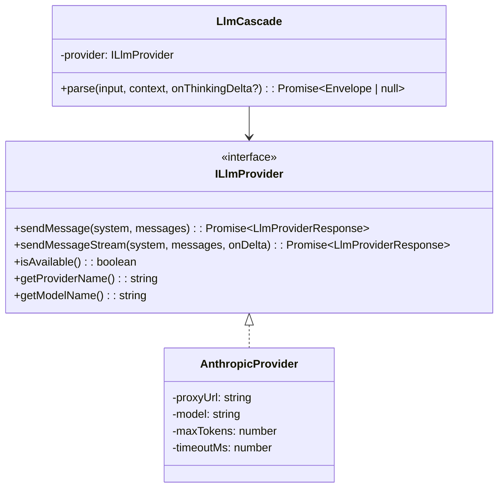

# Stage 2 LLM Cascade — Technical Specification (v3)

> Spec for handoff to a coding agent. Each task has exact file paths, types, signatures, and insertion points.

---

## Decisions

| # | Decision | Value |
|---|----------|-------|
| 1 | LLM default state | OFF (`#LLM-ON` to enable) |
| 2 | System prompt | File: `public/text/system/parser-llm-system.md` |
| 3 | `final_response` | Yes, from v1 — primary creative output mode |
| 4 | API timeout | 10 seconds |
| 5 | Thinking indicator | Show `...` in game log, update to show activity during streaming |
| 6 | Provider abstraction | `ILlmProvider` interface; `AnthropicProvider` is first impl |
| 7 | Proxy endpoint | `/api/llm` in Vite dev server middleware, **with SSE streaming passthrough** |
| 8 | API key source | `process.env.ANTHROPIC_API_KEY` — OS env var, **no `.env` file, no dotenv** |
| 9 | Claude model | `claude-haiku-4-20250414` |
| 10 | Max tokens | 1024 |
| 11 | LLM role | **Game Master**, not just parser. Creative text generation, atmosphere, humor, NPC seeds |
| 12 | Streaming | Infrastructure-ready via `onDelta` callback. v1 accumulates full response; future: character-by-character output |

---

## Architecture



---

## Task 1: Update `parserTypes.ts`

**File:** `src/mechanics/parserTypes.ts`

### 1a. Add `'llm-v3'` to envelope stage

**Line 252**, change:
```ts
  stage: 'regex-v1' | 'pending-resolution' | 'nlp-v2';
```
to:
```ts
  stage: 'regex-v1' | 'pending-resolution' | 'nlp-v2' | 'llm-v3';
```

### 1b. Add `LlmCascadeDebugInfo` type

Append after `ParserResponse` (after line 316):
```ts
export type LlmCascadeDebugInfo = {
  input: string;
  normalizedInput: string;
  matched: boolean;
  provider: string;
  model?: string;
  durationMs?: number;
  tokensGenerated?: number;
  rawResponse?: string;
  error?: string;
  reason?: 'provider_unavailable' | 'api_error' | 'invalid_response' | 'timeout' | 'disabled';
};
```

---

## Task 2: Create `ILlmProvider`

**File:** `src/mechanics/llm/ILlmProvider.ts` (NEW)

```ts
export type LlmProviderMessage = {
  role: 'user' | 'assistant';
  content: string;
};

export type LlmProviderResponse = {
  ok: boolean;
  text: string;
  model?: string;
  error?: string;
  durationMs: number;
};

/**
 * Callback invoked with each text delta during streaming.
 * `accumulated` is the full text so far; `delta` is the new fragment.
 */
export type LlmStreamDeltaCallback = (delta: string, accumulated: string) => void;

export interface ILlmProvider {
  /**
   * Simple one-shot request. Returns full response.
   */
  sendMessage(
    system: string,
    messages: LlmProviderMessage[]
  ): Promise<LlmProviderResponse>;

  /**
   * Streaming request. Invokes `onDelta` for each text fragment as it arrives.
   * Returns the same LlmProviderResponse with full accumulated text at the end.
   * Falls back to `sendMessage` behavior if streaming is not supported.
   */
  sendMessageStream(
    system: string,
    messages: LlmProviderMessage[],
    onDelta: LlmStreamDeltaCallback
  ): Promise<LlmProviderResponse>;

  /** Whether the provider is ready (cheap check, no API call). */
  isAvailable(): boolean;

  /** Human-readable provider name for debug. */
  getProviderName(): string;

  /** Model identifier for debug. */
  getModelName(): string;
}
```

---

## Task 3: Create `AnthropicProvider`

**File:** `src/mechanics/llm/AnthropicProvider.ts` (NEW)

### Constructor

```ts
constructor(options?: {
  proxyUrl?: string;   // default: '/api/llm'
  model?: string;      // default: 'claude-haiku-4-20250414'
  maxTokens?: number;  // default: 1024
  timeoutMs?: number;  // default: 10000
})
```

### `sendMessage()`

- Calls `sendMessageStream()` with a no-op `onDelta` (reuses streaming impl)

### `sendMessageStream()`

1. POST to `this.proxyUrl` with body: `{ model, max_tokens, system, messages, stream: true }`
2. Use `AbortController` with `setTimeout(timeoutMs)` for timeout
3. Measure duration with `performance.now()`
4. Read response as SSE stream:
   - If response status is not 200 — fallback: read body as text, return `{ ok: false, error }`
   - Parse SSE events line by line:
     - `event: content_block_delta` → data contains `{ delta: { text: "..." } }` → call `onDelta(delta, accumulated)`
     - `event: message_stop` → done
     - `event: error` → set error
5. Return `{ ok: true, text: accumulated, model, durationMs }`

### SSE parsing helper

Anthropic SSE format:
```
event: content_block_delta
data: {"type":"content_block_delta","index":0,"delta":{"type":"text_delta","text":"Hello"}}

event: message_stop
data: {"type":"message_stop"}
```

Parse each SSE line:
- Lines starting with `event: ` → store event type
- Lines starting with `data: ` → parse JSON, extract based on event type
- Empty lines → separator between events

### `isAvailable()` → always `true` (proxy handles key presence)

### `getProviderName()` → `'Anthropic (proxy)'`

### `getModelName()` → `this.model`

---

## Task 4: Create `LlmCascade`

**File:** `src/mechanics/LlmCascade.ts` (NEW)

### Constructor

```ts
constructor(
  provider: ILlmProvider,
  getTextAssets: () => TextAssetManager | undefined,
  getConsole: () => { log: (text: string, type?: any) => void } | undefined
)
```

### Fields

```ts
private provider: ILlmProvider;
private getTextAssets: () => TextAssetManager | undefined;
private getConsole: () => { ... } | undefined;
private lastDebugInfo: LlmCascadeDebugInfo | null = null;
private systemPromptCache: string | null = null;
```

### Public API

```ts
async parse(
  input: string,
  context: ParserContext,
  onThinkingDelta?: (delta: string, accumulated: string) => void
): Promise<ParserCascadeEnvelope | null>

getLastDebugInfo(): LlmCascadeDebugInfo | null
clearLastDebugInfo(): void
```

### `parse()` flow

1. Check `provider.isAvailable()` — if false, set debug with `reason: 'provider_unavailable'`, return null
2. Load system prompt (fetch `public/text/system/parser-llm-system.md`, cache after first load; on failure use hardcoded fallback)
3. Build user message:
   ```
   Player command: "<rawInput>"

   Game world context:
   <JSON.stringify(context, null, 2)>

   Respond with a single JSON object. Do not add any text outside the JSON.
   ```
4. Call `provider.sendMessageStream(systemPrompt, [{ role: 'user', content: userMessage }], onDelta)` where `onDelta` forwards to `onThinkingDelta` if provided
5. If `!response.ok`: set debug with error, return null
6. Extract JSON from response text (handle markdown fences, leading/trailing text)
7. Parse and validate JSON
8. Build `ParserCascadeEnvelope`
9. Set debug info, return envelope

### JSON extraction

```ts
private extractJson(text: string): string {
  const fenceMatch = /```(?:json)?\s*\n?([\s\S]*?)\n?\s*```/.exec(text);
  if (fenceMatch) return fenceMatch[1].trim();
  const braceMatch = /\{[\s\S]*\}/.exec(text);
  if (braceMatch) return braceMatch[0].trim();
  return text.trim();
}
```

### Response validation and envelope building

The LLM may return three `kind` values:

**`plan`** → pass through as-is:
```ts
{ stage: 'llm-v3', output: { kind: 'plan', actions: validatedActions }, debug }
```

**`final_response`** → convert to plan with `showText`:
```ts
{
  stage: 'llm-v3',
  output: {
    kind: 'plan',
    actions: [{ type: 'showText', message: parsed.message }]
  },
  debug
}
```

**`clarification`** → convert to `showText` for v1:
```ts
{
  stage: 'llm-v3',
  output: {
    kind: 'plan',
    actions: [{ type: 'showText', message: parsed.question }]
  },
  debug
}
```

### Action whitelist

```ts
const ALLOWED_ACTION_TYPES = new Set([
  'lookScene', 'lookTarget', 'lookRelationTarget',
  'examineTarget', 'examineRelationTarget',
  'takeTarget', 'putTarget',
  'openTarget', 'closeTarget',
  'showInventory', 'goToTarget',
  'showText',
]);
```

Filter out unknown action types (log to debug). If all actions invalid → return null.

---

## Task 5: System Prompt

**File:** `public/text/system/parser-llm-system.md` (NEW)

```markdown
You are a command-line parser and Game Master for a Sierra-style (80s) classic adventure game running on the Scanline Engine.

## Who You Are

You are the player's alter ego — a voice in their head with whom they can mentally converse. At the same time, you are something like a narrator in a noir movie: laconic, atmospheric, with a dry sense of humor.

You are not just a command parser. You bring the world to life. You interpret what the player wants, execute game actions when possible, and respond with vivid, in-character prose when appropriate.

## Your Responsibilities

- **Interpret commands** the simpler parser layers couldn't understand — map creative phrasing to concrete game actions
- **Generate descriptions** of objects, locations, and scenes with atmosphere and personality
- **Craft witty responses** to player's remarks, jokes, and conversational input — dry humor, 80s noir style
- **Create flavor text** that makes the world feel alive and reactive. You MAY add atmospheric details.
- **Seed NPC dialogue** when the player tries to talk to or interact with characters
- **Handle failures gracefully** — if an action can't be performed, come up with a credible in-world reason why (preferably with a little humor)

## Style Guide

- Answer with SHORT in-world replies: **1–3 sentences**, 80s noir tone, dry humor
- No modern slang. No emoji. No exclamation marks unless truly warranted.
- Think Raymond Chandler narrating a point-and-click adventure
- When something fails, don't say "you can't do that" — invent a reason why. The door is jammed. The thing is bolted to the floor. Your hands are too greasy. Be creative.

## Context

You receive the player's text command and a JSON snapshot of the current game world including:
- Current scene (title, description)
- Visible entities with titles, descriptions, details, and synonyms
- Player inventory
- Spatial relationships between objects (on, in, under, behind)
- Any pending actions

## Available Actions

When the player's input maps to a game command, return a structured action plan. You may use ONLY these action types:

- `{ "type": "lookScene" }` — describe the current scene
- `{ "type": "lookTarget", "target": "<title>" }` — look at a specific object
- `{ "type": "lookRelationTarget", "relation": "<on|in|under|behind>", "anchor": "<title>" }` — look at objects in a spatial relation
- `{ "type": "examineTarget", "target": "<title>" }` — examine an object closely
- `{ "type": "examineRelationTarget", "relation": "<on|in|under|behind>", "anchor": "<title>" }` — examine objects in a spatial relation
- `{ "type": "takeTarget", "target": "<title>" }` — pick up an object
- `{ "type": "putTarget", "item": "<title>", "target": "<title>", "relation": "<on|in|under|behind>" }` — place an item somewhere
- `{ "type": "openTarget", "target": "<title>" }` — open something
- `{ "type": "closeTarget", "target": "<title>" }` — close something
- `{ "type": "showInventory" }` — show player's inventory
- `{ "type": "goToTarget", "target": "<title>" }` — move to a location or object
- `{ "type": "showText", "message": "<text>" }` — show a message to the player (use for flavor, atmosphere, reactions, failure explanations)

## Response Format

Respond with exactly ONE JSON object. No text outside the JSON. Choose one format:

### Action Plan (when the player gives a game command)
```json
{ "kind": "plan", "actions": [ { "type": "...", ... } ] }
```

### Direct Response (for atmosphere, conversation, reactions, or when no game action fits)
```json
{ "kind": "final_response", "message": "Your noir-flavored response here." }
```

## Rules

1. **Use only real objects.** The `target` value MUST match a `title` from the context's `entities` or `inventory`. Never invent objects not present in the context.
2. **Synonyms.** If the player uses a word matching a `synonyms` entry, map to the object's `title`.
3. **Spatial awareness.** Use `spatialNodes` and `spatialRelations` to understand object positions.
4. **Be grounded.** You can add atmospheric details, but don't contradict the game state. Don't mention things that aren't in the context.
5. **Be concise.** 1–3 sentences. This is a retro game, not a novel.
6. **Match player language.** Respond in the same language the player used for their command.
7. **One linear plan.** No conditionals, no loops, no branching.
8. **No code.** Never return JavaScript, TypeScript, or executable code.
9. **When in doubt, respond in character.** If the player says something conversational, philosophical, or absurd — give them a noir-flavored reply. The world should feel alive and sardonic.
10. **Failed actions need reasons.** Never say "you can't do that." Instead, invent a plausible, in-world reason — the more dry and witty, the better.
```

---

## Task 6: Vite Proxy Endpoint

**File:** `vite.config.ts`

> [!IMPORTANT]
> **No `dotenv`**. The API key comes from the OS environment variable `ANTHROPIC_API_KEY`. Vite dev server can read it via `process.env.ANTHROPIC_API_KEY` directly.

Add middleware **inside `configureServer(server)` block**, after the last `/api/delete-file` middleware (before closing `}`):

```ts
// LLM Proxy Endpoint (streaming SSE passthrough)
server.middlewares.use('/api/llm', (req, res, next) => {
  if (req.method !== 'POST') { next(); return; }

  const apiKey = process.env.ANTHROPIC_API_KEY;
  if (!apiKey) {
    res.statusCode = 503;
    res.setHeader('Content-Type', 'application/json');
    res.end(JSON.stringify({ error: 'ANTHROPIC_API_KEY not configured' }));
    return;
  }

  let body = '';
  req.on('data', (chunk) => { body += chunk.toString(); });
  req.on('end', async () => {
    try {
      const payload = JSON.parse(body);
      const isStream = !!payload.stream;

      const response = await fetch('https://api.anthropic.com/v1/messages', {
        method: 'POST',
        headers: {
          'Content-Type': 'application/json',
          'x-api-key': apiKey,
          'anthropic-version': '2023-06-01',
        },
        body: JSON.stringify({
          model: payload.model || 'claude-haiku-4-20250414',
          max_tokens: payload.max_tokens || 1024,
          system: payload.system || '',
          messages: payload.messages || [],
          stream: isStream,
        }),
      });

      if (isStream && response.ok && response.body) {
        // SSE passthrough
        res.statusCode = 200;
        res.setHeader('Content-Type', 'text/event-stream');
        res.setHeader('Cache-Control', 'no-cache');
        res.setHeader('Connection', 'keep-alive');

        const reader = response.body.getReader();
        const decoder = new TextDecoder();
        try {
          while (true) {
            const { done, value } = await reader.read();
            if (done) break;
            res.write(decoder.decode(value, { stream: true }));
          }
        } catch (streamErr) {
          console.error('[Vite] LLM stream error:', streamErr);
        } finally {
          res.end();
        }
      } else {
        // Non-streaming or error passthrough
        const data = await response.text();
        res.statusCode = response.status;
        res.setHeader('Content-Type', 'application/json');
        res.end(data);
      }
    } catch (err) {
      console.error('[Vite] LLM proxy error:', err);
      res.statusCode = 502;
      res.end(JSON.stringify({ error: String(err) }));
    }
  });
});
```

---

## Task 7: Console Toggle

**File:** `src/core/Console.ts`

### 7a. Add field (after line 24)

```ts
  parserLlmEnabled: boolean = false;
```

### 7b. Register commands (after `#STAGE2-ON` block, after line 170)

```ts
    this.registerCommand('#LLM-ON', () => {
      this.parserLlmEnabled = true;
      this.log('LLM cascade enabled.', 'info');
    });

    this.registerCommand('#LLM-OFF', () => {
      this.parserLlmEnabled = false;
      this.log('LLM cascade disabled.', 'info');
    });
```

---

## Task 8: Parser Integration

**File:** `src/mechanics/Parser.ts`

### 8a. Add imports (after line 2, near NlpCascade import)

```ts
import { LlmCascade } from './LlmCascade';
import type { LlmCascadeDebugInfo } from './parserTypes';
import { AnthropicProvider } from './llm/AnthropicProvider';
```

### 8b. Add field (after line 50, `pendingClarificationRetryMessage`)

```ts
  llmCascade: LlmCascade;
```

### 8c. Initialize in constructor (after line 60, after `this.worldModelBuilder`)

```ts
    this.llmCascade = new LlmCascade(
      new AnthropicProvider(),
      () => this.game.textAssets,
      () => this.game.console
    );
```

### 8d. Add LLM cascade step in `parse()` (after lines 89-98, after NLP cascade block)

Insert after the existing NLP cascade block:

```ts
      // Stage 2 LLM cascade: if still handoff after NLP, try LLM
      if (
        !actionEnvelope &&
        this.game.console?.parserLlmEnabled === true &&
        this.isHandoffEnvelope(envelope)
      ) {
        this.game.log('...');
        try {
          this.llmCascade.clearLastDebugInfo();
          const llmEnvelope = await this.llmCascade.parse(trimmed, context);
          if (llmEnvelope) {
            envelope = llmEnvelope;
          }
        } catch (llmError) {
          this.game.console?.log(`[LLM error] ${String(llmError)}`, 'error');
        }
      }
```

### 8e. Clear LLM debug (at line 70 after `nlpCascade.clearLastDebugInfo()`)

```ts
      this.llmCascade.clearLastDebugInfo();
```

### 8f. Add LLM debug to `buildResponse()` (around line 3347)

After `const nlpDebug = ...` add:
```ts
    const llmDebug = this.llmCascade.getLastDebugInfo();
```

In `peekMessages` array, after the nlpDebug entry, add:
```ts
          ...(llmDebug ? [formatSection('llm', llmDebug)] : []),
```

---

## Task 9: `.gitignore` update only

**File:** `.gitignore`

Append:
```
# Environment variables
.env
.env.local
```

> No `.env.example`, no `.env` file, no `dotenv` dependency. The user sets `ANTHROPIC_API_KEY` as an OS environment variable themselves.

---

## Execution Order

```
1. Task 1  — parserTypes.ts (types needed by later files)
2. Task 2  — ILlmProvider.ts (interface needed by Tasks 3, 4)
3. Task 3  — AnthropicProvider.ts (depends on Task 2)
4. Task 5  — System prompt file (no code deps)
5. Task 4  — LlmCascade.ts (depends on Tasks 1, 2)
6. Task 6  — vite.config.ts proxy (independent)
7. Task 7  — Console.ts toggle (independent)
8. Task 8  — Parser.ts integration (depends on all above)
9. Task 9  — .gitignore (trivial)
```

No npm dependencies need to be installed.

---

## Verification Checklist

1. `npm run dev` — no TS errors
2. Without API key: game works normally; `#LLM-ON` + unknown command → shows `...` then `parser.parse_unknown`; vite console shows 503 error
3. With API key: `#LLM-ON` + `#PEEK-ON` + type "look logotype" → LLM resolves to `lookTarget: logo` → game shows description; peek shows LLM debug block
4. Type "hello" → LLM returns `final_response` with witty Game Master reply
5. `#LLM-OFF` → fallback to Stage 1 behavior
6. Normal command "LOOK" → handled by Stage 1.1, LLM never called
