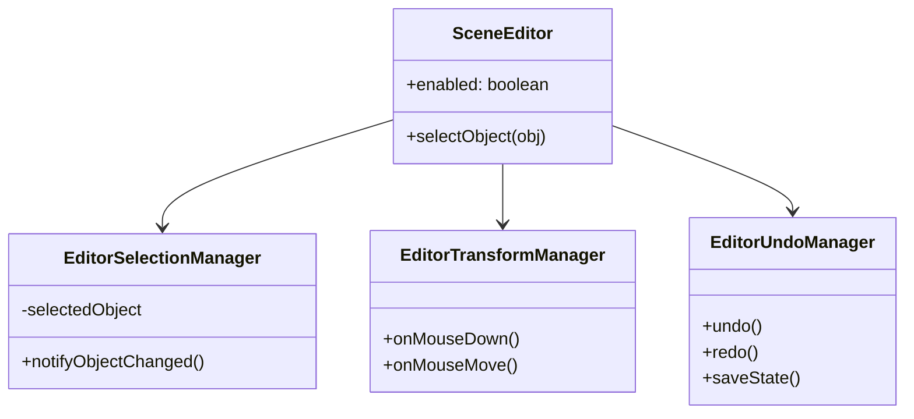

# Quest Engine Technical Specification

## 1. Architecture Overview (Current)

The engine architecture has undergone significant refactoring to separate concerns, improve maintainability, and ensure UI reactivity.

### 1.1. Scene Editor Decomposition

The monolithic `SceneEditor` class has been decomposed into specialized managers using a **Facade Pattern**.

* **`SceneEditor.ts` (Facade)**: The central entry point. calls are delegated to specific managers. It holds the shared state (reference to Game, generic Input handlers).
* **`EditorSelectionManager.ts`**: Handles object selection logic (Scene, Settings, Entities), exclusive selection rules, and **Reactive Notifications**.
* **`EditorTransformManager.ts`**: Handles mouse interaction in the canvas (Drag, Resize, Gizmos).
* **`EditorUndoManager.ts`**: Manages the Undo/Redo stack (Command Pattern).
* **`EditorUI.ts`**: Handles DOM overlays and event listeners for the non-React parts of the UI (Context menus).



### 1.2. Rendering Pipeline

Rendering logic was extracted from `Scene.ts` into a dedicated **Descriptive Renderer**.

* **`SceneRenderer.ts`**: Stateless renderer. Receives a `Scene` and `Context` and draws the frame.
* **Pipeline**:
    1. **Parallax Layers Setup**
    2. **Sorting**: Entities are sorted by Z-index (Layer), then by Y-coordinate for depth. Special handling for QuadObjects with Sort Modes.
    3. **Render Pass**:
        * **Background / Normal Layer**: Standard entities and static objects.
        * **Foregound Effects**: Blur (if active subscene).
        * **Subscene Layer**: Highlighted interactive elements.
    4. **Debug Overlays**:
        * **Walkboxes**: Invert (Green), Add (Blue), Subtract (Red/Cutout).
        * **Triggerboxes**: Red overlay (only when selected).
        * **Selection**: Magenta editing handles.

### 1.3. Reactive Data Binding (Zero-Cost Observations)

To synchronize Game Logic (Scripts/Physics) with Editor UI without polling overhead:

* **Smart Entities**: `Entity.ts` uses TypeScript Getters/Setters for mutable properties (`x`, `y`, `parallax`, `width`, `height`).
* **Lazy Notification**:

    ```typescript
    set x(val) {
        this._x = val;
        // Check avoids cost when playing game logic
        if (this.game.editor && this.game.editor.enabled) { 
             notify() 
        }
    }
    ```

* **Batched Updates**: `EditorSelectionManager` uses a dirty flag and `requestAnimationFrame` to coalesce multiple property changes into a single Zustand Store update per frame.

### 1.4. React UI Architecture (Implemented)

The Editor UI has been fully migrated to React + Zustand, replacing legacy DOM manipulation:

* **`HierarchyPanel.tsx`**: Renders the scene tree. Reactive to addition/deletion/renaming via `store.hierarchyVersion`.
* **`PropertiesPanel.tsx`**: Renders dynamic forms based on `selectedObjectType`. Usese **Controlled Components** with two-way binding to the underlying Engine Objects.
* **`editorStore.ts`**: Zustand store holding ephemeral editor state (Selection ID, Modes, Versions).

---

## 2. Roadmap & Future Tasks

### 2.1. Immediate Term (Editor Polish)

* [x] **React-based Hierarchy**: Migrated to `HierarchyPanel.tsx`.
* [x] **Controlled Components for Properties**: Migrated to `PropertiesPanel.tsx`.
* [x] **DOM Element Caching**: Implemented in `EditorUI` for remaining native inputs (e.g. Parser).
* [x] **Undo/Redo**: Full stack implemented with keyboard shortcuts (Ctrl+Z / Ctrl+Y).
* [x] **Object Locking**: Alt+L toggle implemented.
* [ ] **Prefab System**: Save/Load object templates (Actors, Static groups) to disk for reuse.

### 2.2. Medium Term (Engine Features)

* [ ] **Asset Database**: Centralized manifest for all assets (sprites, sounds) to prevent duplicate loading and allow preloading strategies.
* [ ] **Typed Signals/Events**: Replace ad-hoc EventListeners with a lightweight Signals implementation for internal engine communication (e.g., `onSceneChange`, `onEntityDestroy`).

### 2.3. Long Term (Architecture)

* [ ] **ECS Migration (Partial)**: The current `Entity` + `Components` array is a hybrid. Moving towards a stricter Entity-Component-System could improve performance for complex scenes (systems iterating over arrays of components rather than objects).
* [ ] **Virtual Scripting VM**: Isolate user scripts from the engine core to prevent crashes and allow for sandboxed execution (e.g., `yield` support for cutscenes).

## 3. New Features Documentation

### 3.1. Entity Properties

Standard Entities (`Static`, `Actor`) now support enhanced visual properties:

* **Opacity**: 0.0 - 1.0 transparency.
* **Blend Mode**: `source-over`, `multiply`, `screen`, `overlay`, `lighter`, `difference`.
* **Blur**: Background blur effect (0-50px).
* **Parallax**: Global parallax factor affecting X/Y rendering relative to Camera.

### 3.2. Quad Objects

A generic polygon object (`QuadObject`) for creating perspective geometry (walls, floors).

* **Per-Vertex Parallax**: Each vertex has its own `p` factor, allowing for 2.5D perspective distortion.
* **Texture/Modify**: Supports color fill or retro grid rendering.
* **Sorting**: Can sort by average Y, or force sort based on specific vertex Y (useful for walls).

### 3.3. Walkbox & Triggerbox

* **Walkbox**: Defines walkable areas. Supports boolean operations:
  * `Invert` (Standard walkable area).
  * `Add` (Connects areas).
  * `Subtract` (Holes/Obstacles).
* **Triggerbox**: Defines event zones. Executes scripts when Player entires (`enter`, `leave`, `stay` events managed by game loop).

### 3.4. Parallax & Coordinate Systems

The engine uses a 2.5D displacement model where objects sharing the same world coordinates (X,Y) appear at different screen locations based on their Parallax Factor (`p`) and the Camera Position.

#### 3.4.1. Rendering Model

* **Formula**: `VisualPos = RawPos - Camera * (P - 1)`
* **Behavior**:
  * `P = 1.0`: Standard layer. `VisualPos = RawPos`. Moves 1:1 with Camera.
  * `P = 0.0`: Infinite distance. `VisualPos = RawPos + Camera`. Objects strictly follow the camera (Static UI / Skybox).
  * `P > 1.0`: Foreground. Moves faster than camera.

#### 3.4.2. Interaction Formula (Visual Consistency)

When manipulating objects with the mouse (Drag, Snapping), we often need to calculate a new position such that the object *visually* aligns with a target (Mouse Cursor, Grid, or other Object).

* **Problem**: Converting "Mouse Position (P=1)" directly to "Object World Space (P?)" is error-prone if intermediate steps assume mixed spaces.
* **Robust Solution (Relative Parallax)**: Instead of converting to P=1 and back, transform coordinates directly between Parallax Planes:
  * `Pos_New = Pos_Old + Camera * (P_Target - P_Source)`
  * Use this for Snapping logic to align a vertex at distinct `P_Source` to a target at `P_Target`.

#### 3.4.3. Known Pitfalls (Lessons Learned)

During development, several critical edge cases were identified:

1. **"Double Parallax" (The Jumping Bug)**:
    * **Context**: Input handlers (e.g. `onMouseMove`) often calculate a `newPosition` based on mouse movement.
    * **The Trap**: If you calculate a correct **Raw Coordinate** using complex logic (like binding resolution), but then assign it to a variable that the *rest of the function* expects to be a **Visual Coordinate**, the system might applying the Parallax Offset *again* later (thinking it needs to convert Visual -> Raw).
    * **Fix**: Always verify the coordinate space contract of data being passed between logic blocks. If a block finishes by producing a Raw Coordinate, but the pipeline expects a Visual Input, apply the inverse transform (`Raw -> Visual`) before passing it on.

2. **Binding Inheritance**:
    * **Context**: Vertices bound to other objects (e.g. a Quad vertex bound to an Actor).
    * **The Trap**: Using the vertex's own `p` value (usually default `1.0`) instead of the **Target Object's `p`**. This causes the vertex to drift away from its target when the camera moves.
    * **Fix**: Always resolve the **Effective Parallax** by checking the binding target (`entity.parallax`) before performing any geometric calculations.

3. **Visual vs. Geometric Alignment**:
    * **Context**: "Straight Lines" (Angle Snapping).
    * **The Trap**: Calculating angles based on Raw Coordinates. Two points with different `p` values might have Raw Coordinates forming a vertical line, but will appear diagonal on screen.
    * **Fix**: Always align to **Visual Space** (Screen Space). The user interacts with what they see. Calculate Snapping Vectors in the Parallax Plane of the dragged vertex to ensure "What You See Is What You Get".

### 3.5. Shadow System Architecture

The Shadow System implements a hybrid approach to handle the complex interaction between **Actor Depth Scaling** (Shadow must grow/shrink), **Floor Parallax** (Shadow must deform on slopes), and **User Editing** (Shadow must accept manual reshaping).

#### 3.5.1. The Conflict

* **Rigid Caching**: Traditional scaling stores a "Base Shape" and multiplies it by `currentScale`. This prevents the shadow from deforming on slanted floors because the "Base Shape" overrides the correct parallax-distorted shape every frame.
* **Continuous Updates**: Simply recalculating the shadow every frame allows deformation but loses the concept of "User defined shape" size relative to the actor (Scaling).

#### 3.5.2. Solution: Delta Scaling & Neutral Resampling

We use a **Delta Scaling** approach that respects both dynamic updates and scaling:

1. **Continuous Resampling**:
    * Every frame, the system captures the **Current Visual Offsets** of the shadow vertices relative to its anchor (Vertex 0).
    * This captures the *deformed shape* (e.g. result of `3d-parallax` applying slope correction).
    * Critically, we capture **Visual Offsets** (Screen Space), creating a "Neutral Shape" independent of global parallax shifts.

2. **Delta Application**:
    * We track the Actor's scale change: `Ratio = CurrentScale / LastFrameScale`.
    * We multiply the captured Neutral Shape vectors by this `Ratio`.
    * **Result**: The shadow grows/shrinks incrementally with the actor, but the *base shape* it modifies is the one correctly distorted by the floor.

3. **State Management**:
    * The `lastScale` cache is persistent.
    * The cache is **invalidated** only when the Shadow is **Selected/Edited** in the UI. This sets a new "Baseline" effectively saying "The user wants the shadow to look like *this* at the current scale".
