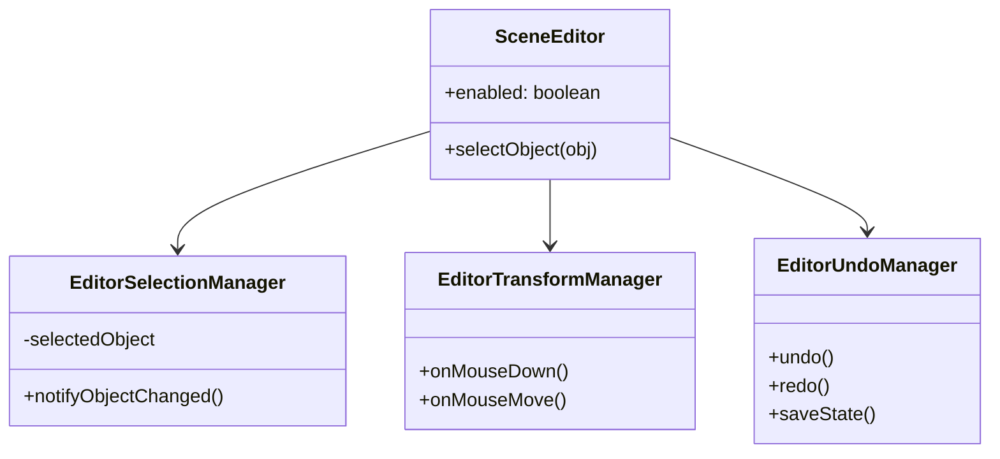

# Quest Engine Technical Specification

## 1. Architecture Overview (Current)

The engine architecture has undergone significant refactoring to separate concerns, improve maintainability, and ensure UI reactivity.

### 1.1. Scene Editor Decomposition
The monolithic `SceneEditor` class has been decomposed into specialized managers using a **Facade Pattern**.

*   **`SceneEditor.ts` (Facade)**: The central entry point. calls are delegated to specific managers. It holds the shared state (reference to Game, generic Input handlers).
*   **`EditorSelectionManager.ts`**: Handles object selection logic (Scene, Settings, Entities), exclusive selection rules, and **Reactive Notifications**.
*   **`EditorTransformManager.ts`**: Handles mouse interaction in the canvas (Drag, Resize, Gizmos).
*   **`EditorUndoManager.ts`**: Manages the Undo/Redo stack (Command Pattern).
*   **`EditorUI.ts`**: Handles DOM overlays and event listeners for the non-React parts of the UI (Context menus).



### 1.2. Rendering Pipeline
Rendering logic was extracted from `Scene.ts` into a dedicated **Descriptive Renderer**.

*   **`SceneRenderer.ts`**: Stateless renderer. Receives a `Scene` and `Context` and draws the frame.
*   **Pipeline**:
    1.  **Parallax Layers Setup**
    2.  **Sorting**: Entities are sorted by Z-index (Layer), then by Y-coordinate for depth. Special handling for QuadObjects with Sort Modes.
    3.  **Render Pass**:
        *   **Background / Normal Layer**: Standard entities and static objects.
        *   **Foregound Effects**: Blur (if active subscene).
        *   **Subscene Layer**: Highlighted interactive elements.
    4.  **Debug Overlays**:
        *   **Walkboxes**: Invert (Green), Add (Blue), Subtract (Red/Cutout).
        *   **Triggerboxes**: Red overlay (only when selected).
        *   **Selection**: Magenta editing handles.

### 1.3. Reactive Data Binding (Zero-Cost Observations)
To synchronize Game Logic (Scripts/Physics) with Editor UI without polling overhead:

*   **Smart Entities**: `Entity.ts` uses TypeScript Getters/Setters for mutable properties (`x`, `y`, `parallax`, `width`, `height`).
*   **Lazy Notification**:
    ```typescript
    set x(val) {
        this._x = val;
        // Check avoids cost when playing game logic
        if (this.game.editor && this.game.editor.enabled) { 
             notify() 
        }
    }
    ```
*   **Batched Updates**: `EditorSelectionManager` uses a dirty flag and `requestAnimationFrame` to coalesce multiple property changes into a single Zustand Store update per frame.

### 1.4. React UI Architecture (Implemented)
The Editor UI has been fully migrated to React + Zustand, replacing legacy DOM manipulation:

*   **`HierarchyPanel.tsx`**: Renders the scene tree. Reactive to addition/deletion/renaming via `store.hierarchyVersion`.
*   **`PropertiesPanel.tsx`**: Renders dynamic forms based on `selectedObjectType`. Usese **Controlled Components** with two-way binding to the underlying Engine Objects.
*   **`editorStore.ts`**: Zustand store holding ephemeral editor state (Selection ID, Modes, Versions).

---

## 2. Roadmap & Future Tasks

### 2.1. Immediate Term (Editor Polish)
*   [x] **React-based Hierarchy**: Migrated to `HierarchyPanel.tsx`.
*   [x] **Controlled Components for Properties**: Migrated to `PropertiesPanel.tsx`.
*   [x] **DOM Element Caching**: Implemented in `EditorUI` for remaining native inputs (e.g. Parser).
*   [x] **Undo/Redo**: Full stack implemented with keyboard shortcuts (Ctrl+Z / Ctrl+Y).
*   [x] **Object Locking**: Alt+L toggle implemented.
*   [ ] **Prefab System**: Save/Load object templates (Actors, Static groups) to disk for reuse.

### 2.2. Medium Term (Engine Features)
*   [ ] **Asset Database**: Centralized manifest for all assets (sprites, sounds) to prevent duplicate loading and allow preloading strategies.
*   [ ] **Typed Signals/Events**: Replace ad-hoc EventListeners with a lightweight Signals implementation for internal engine communication (e.g., `onSceneChange`, `onEntityDestroy`).

### 2.3. Long Term (Architecture)
*   [ ] **ECS Migration (Partial)**: The current `Entity` + `Components` array is a hybrid. Moving towards a stricter Entity-Component-System could improve performance for complex scenes (systems iterating over arrays of components rather than objects).
*   [ ] **Virtual Scripting VM**: Isolate user scripts from the engine core to prevent crashes and allow for sandboxed execution (e.g., `yield` support for cutscenes).

## 3. New Features Documentation

### 3.1. Entity Properties
Standard Entities (`Static`, `Actor`) now support enhanced visual properties:
*   **Opacity**: 0.0 - 1.0 transparency.
*   **Blend Mode**: `source-over`, `multiply`, `screen`, `overlay`, `lighter`, `difference`.
*   **Blur**: Background blur effect (0-50px).
*   **Parallax**: Global parallax factor affecting X/Y rendering relative to Camera.

### 3.2. Quad Objects
A generic polygon object (`QuadObject`) for creating perspective geometry (walls, floors).
*   **Per-Vertex Parallax**: Each vertex has its own `p` factor, allowing for 2.5D perspective distortion.
*   **Texture/Modify**: Supports color fill or retro grid rendering.
*   **Sorting**: Can sort by average Y, or force sort based on specific vertex Y (useful for walls).

### 3.3. Walkbox & Triggerbox
*   **Walkbox**: Defines walkable areas. Supports boolean operations:
    *   `Invert` (Standard walkable area).
    *   `Add` (Connects areas).
    *   `Subtract` (Holes/Obstacles).
*   **Triggerbox**: Defines event zones. Executes scripts when Player entires (`enter`, `leave`, `stay` events managed by game loop).

### 3.4. Parallax Auto-Correction
The Editor implements logic to prevent visual jumping when adjusting Parallax.
*   **Problem**: Changing `p` shifts the object's screen position if Camera != 0,0.
*   **Solution**: `x_new = x_old + Camera * (p_new - p_old)`. This counter-adjusts the world position so the object appears stationary on screen during the edit.
*   **Scope**: Applied to `Entity` and `Actor`.
