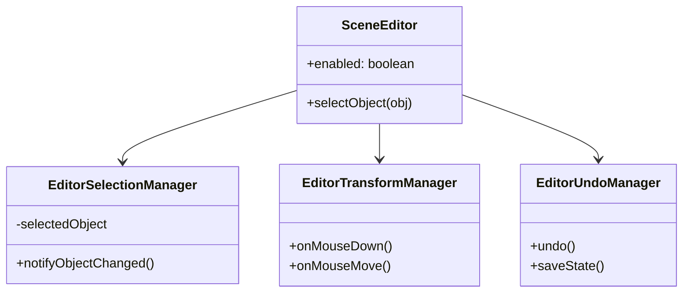

# Quest Engine Technical Specification

## 1. Architecture Overview (Current)

The engine architecture has undergone significant refactoring to separate concerns, improve maintainability, and ensure UI reactivity.

### 1.1. Scene Editor Decomposition
The monolithic `SceneEditor` class has been decomposed into specialized managers using a **Facade Pattern**.

*   **`SceneEditor.ts` (Facade)**: The central entry point. calls are delegated to specific managers. It holds the shared state (reference to Game, generic Input handlers).
*   **`EditorSelectionManager.ts`**: Handles object selection logic (Scene, Settings, Entities), exclusive selection rules, and **Reactive Notifications**.
*   **`EditorTransformManager.ts`**: Handles mouse interaction in the canvas (Drag, Resize, Gizmos).
*   **`EditorUndoManager.ts`**: Manages the Undo/Redo stack (Command Pattern).
*   **`EditorUI.ts`**: Manages DOM overlays and event listeners for the non-React parts of the UI (Context menus, Hierarchy updates).



### 1.2. Rendering Pipeline
Rendering logic was extracted from `Scene.ts` into a dedicated **Descriptive Renderer**.

*   **`SceneRenderer.ts`**: Stateless renderer. Receives a `Scene` and `Context` and draws the frame.
*   **Pipeline**:
    1.  **Background Color/Image**
    2.  **Parallax Layers** (Sorted by Z-index/Layer ID)
    3.  **Entities** (Sorted by Y-coordinate for pseudo-3D capability)
    4.  **Foreground Effects** (Blur, Scanlines - via `SceneRenderer.renderBlurEffect`)
    5.  **Debug Overlays** (Walkboxes, Colliders - only if Editor enabled)

### 1.3. Reactive Data Binding (Zero-Cost Observations)
To synchronize Game Logic (Scripts/Physics) with Editor UI without polling overhead:

*   **Smart Entities**: `Entity.ts` uses TypeScript Getters/Setters for mutable properties (`x`, `y`, `parallax`, `width`, `height`).
*   **Lazy Notification**:
    ```typescript
    set x(val) {
        this._x = val;
        // Check avoids cost when playing game logic
        if (this.game.editor && this.game.editor.enabled) { 
             notify() 
        }
    }
    ```
*   **Batched Updates**: `EditorSelectionManager` uses a dirty flag and `requestAnimationFrame` to coalesce multiple property changes into a single Zustand Store update per frame.

---

## 2. Roadmap & Future Tasks

### 2.1. Immediate Term (Editor Polish)
*   [ ] **React-based Hierarchy**: Currently `EditorUI.refreshHierarchy` builds HTML via string concatenation. Migrate this to a pure React component (`HierarchyPanel.tsx`) consuming the `useEditorStore`.
*   [ ] **Controlled Components for Properties**: The Properties Panel currently relies on direct DOM manipulation (`input.value = ...`). Refactor to use React Controlled Components synced with `useEditorStore` versioning for smoother two-way binding.
*   [ ] **DOM Element Caching**: In `EditorUI`, cache references to frequently accessed DOM elements (like property inputs) to avoid `document.getElementById` thrashing.

### 2.2. Medium Term (Engine Features)
*   [ ] **Asset Database**: Centralized manifest for all assets (sprites, sounds) to prevent duplicate loading and allow preloading strategies.
*   [ ] **Typed Signals/Events**: Replace ad-hoc EventListeners with a lightweight Signals implementation for internal engine communication (e.g., `onSceneChange`, `onEntityDestroy`).

### 2.3. Long Term (Architecture)
*   [ ] **ECS Migration (Partial)**: The current `Entity` + `Components` array is a hybrid. Moving towards a stricter Entity-Component-System could improve performance for complex scenes (systems iterating over arrays of components rather than objects).
*   [ ] **Virtual Scripting VM**: Isolate user scripts from the engine core to prevent crashes and allow for sandboxed execution (e.g., `yield` support for cutscenes).
